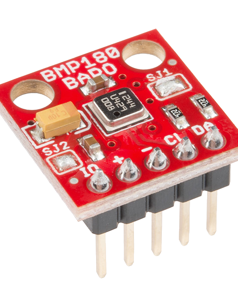
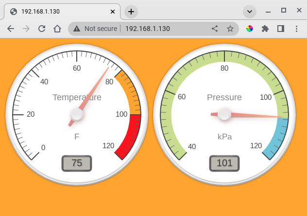

# Temperature/Pressure Sensor

This example uses a cheap ($10) BMP180 barometric pressure/temperature/altitude sensor and a Raspberry Pi  to display temperature and pressure on dial gauges.



## User Interface
The User Interface uses gauge.js javascript library.



## Hardware Setup
* Raspberry Pi (all model except Pico)
* BMP180  pressure/temperature/altitude sensor

Wire the BMP180 to the Raspberry Pi:

```
Sensor	Raspberry Pi
---------------------
VCC	3V3 (Pin 1)
GND	GND (Pin 6)
SCL	SCL (pin 5)
SDA	SDA (Pin 3)
```

## Software Setup
* Use the raspi-config tool to enable  I2C interface on Raspberry Pi
```
sudo raspi-config
```
* Install i2c-utils
```
sudo apt update
sudo apt install -y i2c-tools
```
* Verify I2C connections.  There should be at least one address in use.  (if you see all "--" for all the addresses, something is wrong in finding the I2C device: check wiring).
```
sudo i2cdetect -y 1
```

Files for this example are located in examples/bmp180:
```
examples/bmp180/
├── bmp180.go
├── bmp180.png
├── bmp180_sensor.png
├── build
├── cmd
│   └── bmp180
│       └── main.go
└── README.md
```

## Building
```
$ cd examples/bmp180
$ ./build
```

## Running
```
$ cd examples/bmp180
$ ~/go/bin/bmp180
[00_16_3e_0d_c6_c3] Merle version: v0.0.49
[00_16_3e_0d_c6_c3] Model: "bmp180", Name: "bumpy"
[00_16_3e_0d_c6_c3] Received [SYSTEM]: {"Msg":"_CmdInit"}
[00_16_3e_0d_c6_c3] Public HTTP server listening on port :80
[00_16_3e_0d_c6_c3] Skipping public HTTPS server; port is zero
[00_16_3e_0d_c6_c3] Private HTTP server listening on port :6000
[00_16_3e_0d_c6_c3] Skipping tunnel to mother; missing host
[00_16_3e_0d_c6_c3] Received [SYSTEM]: {"Msg":"_CmdRun"}
[00_16_3e_0d_c6_c3] Would Broadcast: {"Msg":"Update","Temperature":75,"Pressure":101}
```

Open http://localhost on the Raspberry Pi to view the user interface.

Or, open http://<ip address> from another system using the Rapsberry Pi's <IP address>.

In this example, the Raspberry Pi address is 192.168.1.130:
  

