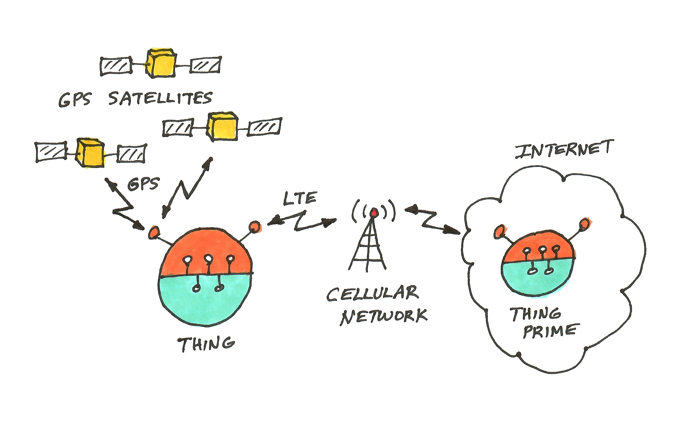
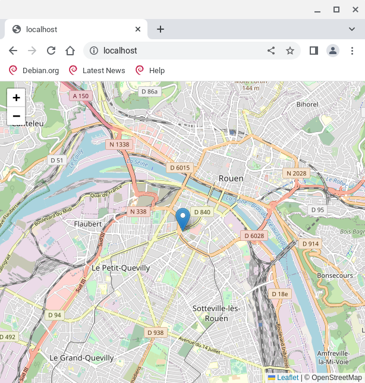

# GPS Locator
This example Thing is a GPS locator running on a Raspberry Pi using a Sixfab
cellular modem to connect to the Internet.  The Sixfab cellular modem also
provides the GPS coordinates.



## User Interface
Thing's user interface shows a map view with a pin at Thing's current location.
The location is checked and updated every minute.



## Hardware Setup
Parts list below.  If you don't have the hardware, don't worrry, you can run
in demo mode on any system with Go installed.  (See Running below).

### Parts List:
* Rapsberry Pi (any model except Pico)
* [Sixfab](https://sixfab.com) Raspberry Pi 4G/LTE Cellular Modem Kit.  I'm using the Telit LE910CF-NF
(North America) LTE module option, $125 for the [kit](https://sixfab.com/product/raspberry-pi-4g-lte-modem-kit/).
It includes a SIM card for $2/month + data.

### Sixfab Setup
* Follow the Sixfab [instructions](https://docs.sixfab.com/) to install the Sixfab software on the Raspberry Pi.
* Activate the Sixfab SIM

## Software Setup
### Installation
```
$ git clone https://github.com/merliot/examples.git
```

Files for this example are located in examples/gps/ and examples/telit.
```
examples/gps                  examples/telit/
├── build                     └── telit.go
├── cmd
│   └── gps
│       └── main.go
├── gps.go
├── gps.png
├── gps_ui.png
└── README.md
```

### Building

```
$ cd examples/gps
$ ./build
Checking setup...
Go version 1.19.1
Building /home/merle/go/bin/gps...
```
The application binary is ~/go/bin/gps.

## Running
### Running in Stand-alone Mode
We can start the application and verify things are working before connecting to the Internet.

We need a Wifi connection on the Raspberry Pi, or someway to interface with the Raspberry Pi.  Let's assume Wifi for this example.

On the Raspberry Pi, run the application to initialize the hardware and start an HTTP server on port :80.
```
$ ~/go/bin/gps
[00_16_3e_0d_c6_c3] Merle version: v0.0.49
[00_16_3e_0d_c6_c3] Model: "gps", Name: "gypsy"
[00_16_3e_0d_c6_c3] Not handled [SYSTEM]: {"Msg":"_CmdInit"}
[00_16_3e_0d_c6_c3] Public HTTP server listening on port :80
[00_16_3e_0d_c6_c3] Skipping public HTTPS server; port is zero
[00_16_3e_0d_c6_c3] Private HTTP server listening on port :6000
[00_16_3e_0d_c6_c3] Skipping tunnel to mother; missing host
[00_16_3e_0d_c6_c3] Received [SYSTEM]: {"Msg":"_CmdRun"}
[00_16_3e_0d_c6_c3] Would Broadcast: {"Msg":"Update","Lat":0,"Long":0}
```
It'll take a bit (few seconds to a few minutes) to lock in the GPS location.  An Update message is broadcast when the location changes.

Browse to Raspberry Pi's IP address on the Wifi network to see the UI.

### Running in Demo Mode
Running in demo mode doesn't require the hardware setup.  Demo mode just cycles through a list of hard-coded lat/long locations.  All you need is a system running Go.  Start the application with the -demo option.  
```
$ ~/go/bin/gps -demo
[00_16_3e_0d_c6_c3] Merle version: v0.0.49
[00_16_3e_0d_c6_c3] Model: "gps", Name: "gypsy"
[00_16_3e_0d_c6_c3] Not handled [SYSTEM]: {"Msg":"_CmdInit"}
[00_16_3e_0d_c6_c3] Public HTTP server listening on port :80
[00_16_3e_0d_c6_c3] Skipping public HTTPS server; port is zero
[00_16_3e_0d_c6_c3] Private HTTP server listening on port :6000
[00_16_3e_0d_c6_c3] Skipping tunnel to mother; missing host
[00_16_3e_0d_c6_c3] Received [SYSTEM]: {"Msg":"_CmdRun"}
[00_16_3e_0d_c6_c3] Would Broadcast: {"Msg":"Update","Lat":0,"Long":0}
[00_16_3e_0d_c6_c3] Would Broadcast: {"Msg":"Update","Lat":57.75,"Long":12}
[00_16_3e_0d_c6_c3] Websocket opened [ws:[::1]:39738/ws/00_16_3e_0d_c6_c3]
[00_16_3e_0d_c6_c3] Received [ws:[::1]:39738]: {"Msg":"_GetIdentity"}
[00_16_3e_0d_c6_c3] Reply: {"Msg":"_ReplyIdentity","Id":"00_16_3e_0d_c6_c3","Model":"gps","Name":"gypsy","O
[00_16_3e_0d_c6_c3] Received [ws:[::1]:39738]: {"Msg":"_GetState"}
[00_16_3e_0d_c6_c3] Reply: {"Msg":"_ReplyState","Lat":57.75,"Long":12}
```
Now browse to http://localhost to see the UI.  The location changes every few minutes.

### Running on the Internet
This requires two systems: the Raspberry Pi and a server on the Internet.  I'm using a VM hosted on [linode.com](https://linode.com) for the server.  The VM runs a copy of our example application and maintains state with the copy running on the Raspberry Pi.

On the VM, build the application as previously done on the Raspberry Pi.  Run as before but add the -prime option:
```
$ ~/go/bin/gps -prime
[prime] Merle version: v0.0.49
[prime] Model: "gps", Name: "gypsy"
[prime] Private HTTP server listening on port :6000
```

