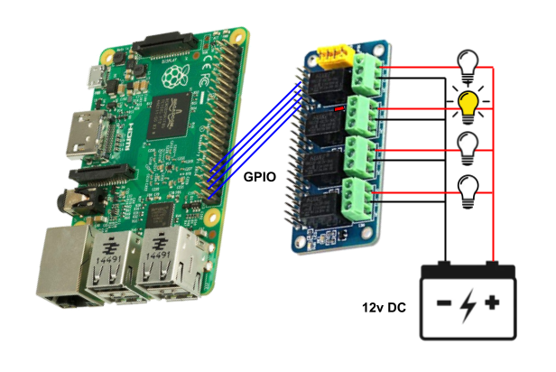
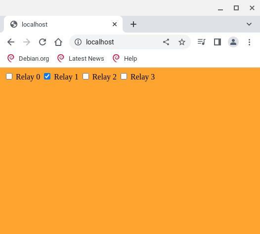

# Relays

This example Thing is a relay controller using a Raspberry Pi and a 4-relay hat to
independently control 4 lights.  Each relay in the 4-relay hat is tied to a GPIO
pin on the Raspberry Pi.  We'll use the [gobot.io](https://gobot.io) library to toggle
the GPIO pins, in turn toggle the relays, and in turn toggle the lights.



### User Interface



## Hardware Setup
### Parts List
* Rapsberry Pi (any model except Pico)
* 4 Channel Relay Shield for Raspberry Pi
* 12v low voltage lights, wire, and 12v battery

The relay hat uses GPIO pins 31, 33, 35, 37 for relay0, relay1, relay2, and relay3.  If your hat uses different GPIO pins, make the adjustments in the code to match.

Each relay on the relay hat is rated for 2A/24V current max, so keep the load within these limits.  You've been warned.

## Software Setup
### Installation
```
$ git clone https://github.com/merliot/examples.git
```
Files for this example are located in examples/relays
```
examples/relays/
├── build
├── cmd
│   └── relays
│       └── main.go
├── README.md
├── relays.go
├── relays.png
└── relays_ui.png
```

### Building
```
$ cd examples/relays
$ ./build
Checking setup...
Go version 1.19.1
Building /home/merle/go/bin/relays...
```
The application binary is ~/go/bin/relays.

### Running
```
$ ~/go/bin/relays 
[00_16_3e_0d_c6_c3] Merle version: v0.0.49
[00_16_3e_0d_c6_c3] Model: "relays", Name: "relaysforhope"
[00_16_3e_0d_c6_c3] Not handled [SYSTEM]: {"Msg":"_CmdInit"}
[00_16_3e_0d_c6_c3] Public HTTP server listening on port :80
[00_16_3e_0d_c6_c3] Skipping public HTTPS server; port is zero
[00_16_3e_0d_c6_c3] Private HTTP server listening on port :6000
[00_16_3e_0d_c6_c3] Skipping tunnel to mother; missing host
[00_16_3e_0d_c6_c3] Received [SYSTEM]: {"Msg":"_CmdRun"}
[00_16_3e_0d_c6_c3] Websocket opened [ws:[::1]:33714/ws/00_16_3e_0d_c6_c3]
[00_16_3e_0d_c6_c3] Received [ws:[::1]:33714]: {"Msg":"_GetIdentity"}
[00_16_3e_0d_c6_c3] Reply: {"Msg":"_ReplyIdentity","Id":"00_16_3e_0d_c6_c3","Model":"relays","Name":"relays
[00_16_3e_0d_c6_c3] Received [ws:[::1]:33714]: {"Msg":"_GetState"}
[00_16_3e_0d_c6_c3] Reply: {"Msg":"_ReplyState","States":[false,false,false,false]}
```
Any relays previously left on will be turned off at startup.

Browse to Raspberry Pi's IP address on the Wifi network to see the UI.  Click the checkboxes on the UI to toggle the relays.


